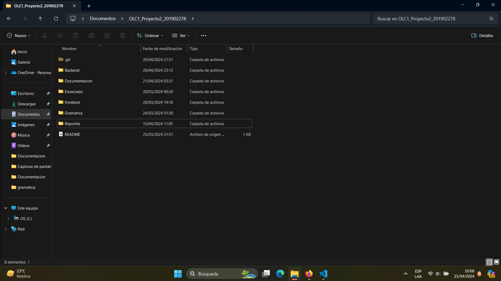
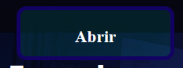
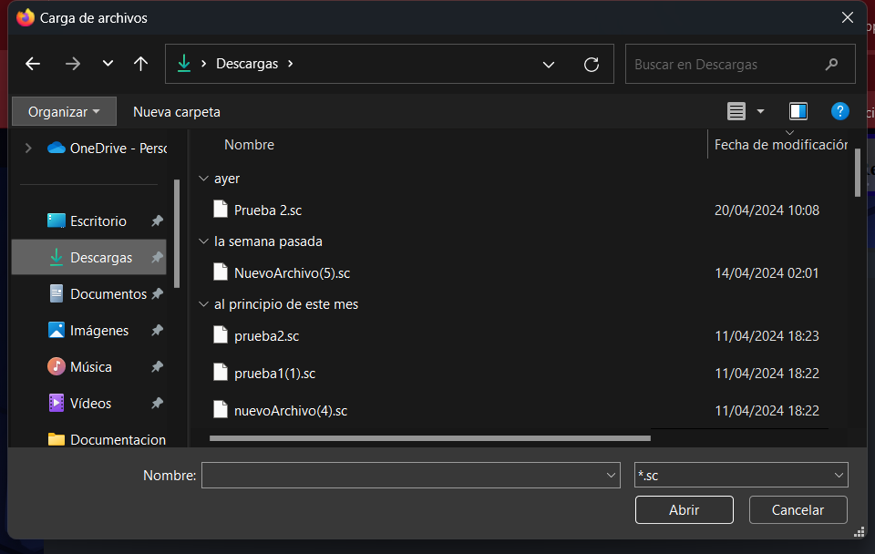
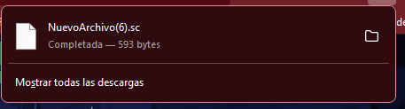
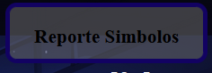
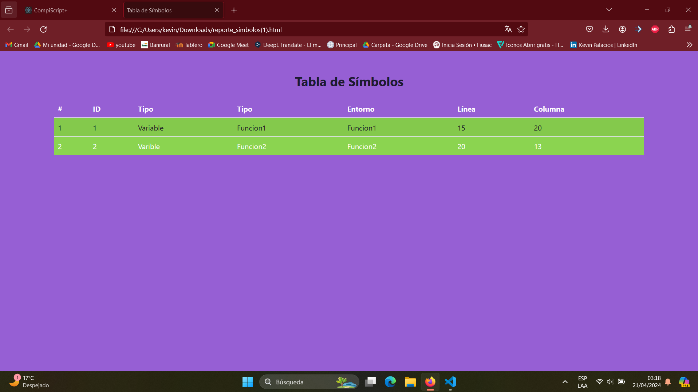
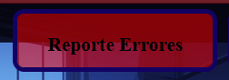
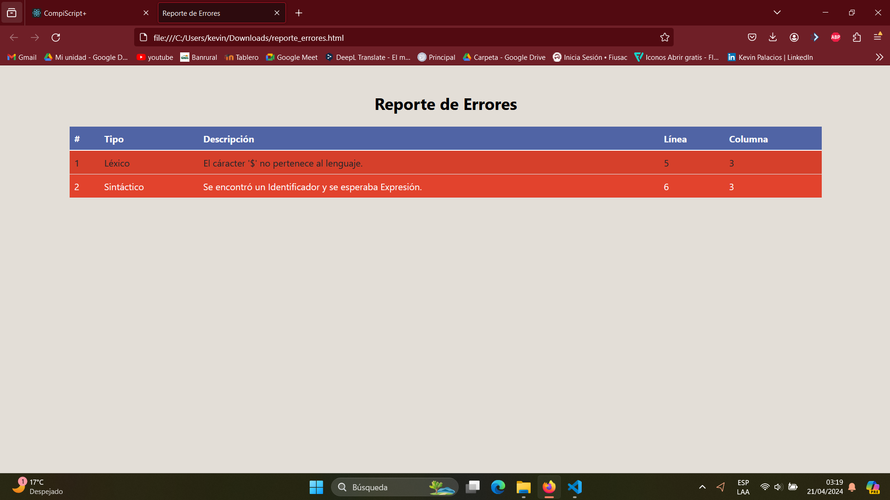
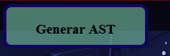
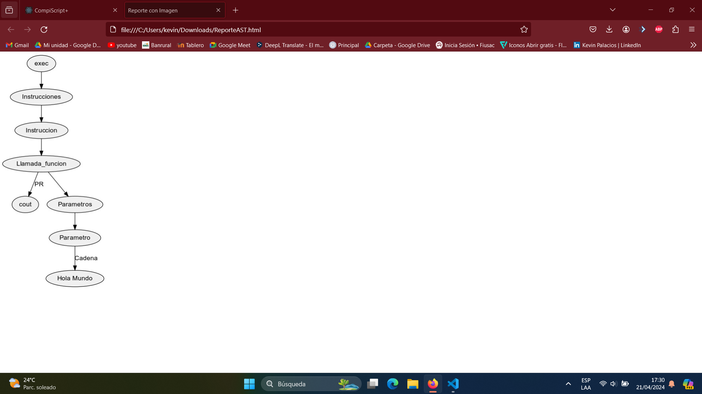

# Manual de Usuario ☝️🤓
# Organización de Lenguajes y Compiladores 1

# Kevin Estuardo Palacios Quiñonez 
# 201902278
---
# Indice 

1. Introducción 

2. Requerimientos 

3. Opciones del Sistema 

4. Manejo del Sistema 

5. Recomendaciones 

6. Créditos

---
# 1. Introducción 🤖
###  1.1 Objetivo
Proporcionar al usuario una guía documentada para utilizar tanto la interfaz gráfica como el manejo del código, asegurando una ejecución exitosa de su entrada de texto sin errores y logrando un uso efectivo de la herramienta.
---
# 2. Requerimientos ✨
## 2.1 Requisitos de Hardware
- Computadora de Escritorio o Portatil.
- Mínimo 4 Gigas de Memoria RAM.
- 20 GB disponibles de Disco Duro.
- Procesador Core i3 o Superior.
- Procesador a 64 bits.
- Pantalla con Resolución Gráfica de 1024*768 píxeles.
## 2.2 Requisitos de Software
- Tener instalado Windows 10 o Superior.
- Tener instalado node js.
- Tener instalado react.
- Tener instalado Jison.
- Tener instalado Graphviz
---
# 3. Opciones del Sistema 🤩
#### En las siguientes páginas se estará explicando el uso de cada una de las funcionalidades que tiene la aplicación:
- Abrir Archivo: se encarga de abrir un archivo de extensión .sc
- Guardar: Se encarga de guardar el archivo abierto.
- Ejecutar: Se encarga de ejecutar el código generado.
- Reporte Errores: Crea un reporte de Errores en html si los hay.
- Reporte Símbolos: Crea un reporte de Símbolos del código ejecutado.
- Generar AST: Genera el ast del codigo ejecutado.
---
# 4. Manejo del Sistema 😎

## 1. Ingreso de la aplicación
### Para poder ingresar a la aplicación es necesario ubicarse en la carpeta del  proyecto y encontrar la siguiente aplicación ejecutable: 
Para poder iniciar el programa colocarse en estas carpetas y abrirlas en visual estudio code:

## 2 Ejecución de código
Para poder ejecutar el codigo se cuenta con las siguientes funciones antes de poder realizar la ejecución:
Abrir Archivo:
Guardar Archivo:
Nuevo Archivo:

## 4.1 Funciones Archivo:
## Crear Archivo: Se encarga de un nuevo Archivo para poder trabajar.

##  Abrir Archivo: Se encarga de abrir el archivo deseado para poder analizarlo.

## Luego de seleccionar el botón abrir se desplegará el siguiente menú :

## Guardar Como: se encarga de guardar el archivo sobre el que esta trabajando.

## Se desplegará de la siguiente manera:

# 5. Reportes
## 5.1 Tabla de Símbolos
### Al seleccionar la opción de:

### Se generará el reporte de Símbolos.

## 5.2  Errores 
### Al seleccionar la opción de:

### Se generará el reporte de Errores.

## 5.3 Arbol AST
### Al seleccionar la opción AST:

### Se guardará en descargas un documento de extensión html:

### Luego de guardarlo buscalo en descargas y abrelo .

---
# 5. Recomendaciones 👀
---
# 6. Créditos 🧐
---
[Enlace a mi repositorio en GitHub](https://github.com/KevinPalaciosQ/OLC1_Proyecto2_201902278.git)